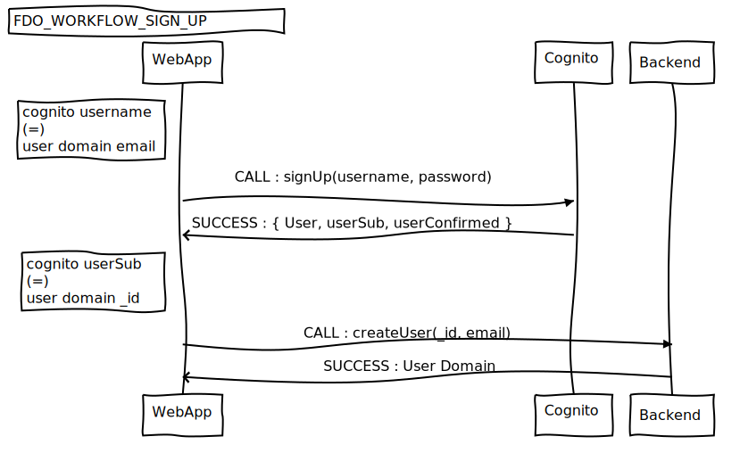

# AUTHENTICATION WORKFLOW

```
!IMPORTANT : 
- cognito username field equals user domain email.
- cognito userSub field equals user domain _id
- cognito userConfirmed equals user domain confirmed
```


